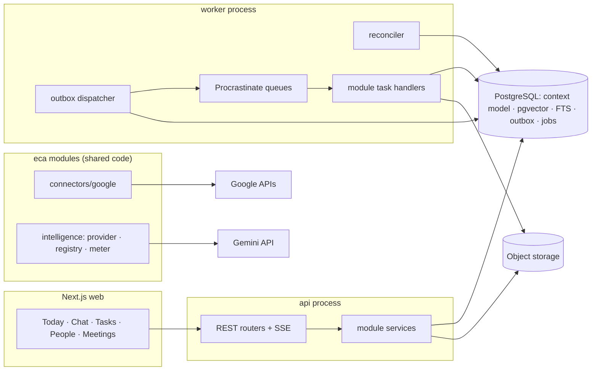

# Technical Design — Executive Context Assistant

**Status:** Reconciled architecture; slices 0.1–0.2 implemented (see `IMPLEMENTATION_PLAN.md` §0); pre-0.3 reconciliation applied 2026-10-02
**Date:** 2026-10-02
**Inputs:** `docs/PRD.md` v1.0, repository inspection, current Google documentation (References), `CLAUDE.md`

This is the umbrella architecture document. It states every major decision and delegates detail to the authoritative documents listed in §5.1. Where this document summarizes a topic owned by another document, the other document wins; summaries here must not add rules.

---

## 1. Executive summary

The Executive Context Assistant is a **context-maintenance system with a chat front end**. Its hard problem is turning emails, calendar events and meeting recordings into a small set of trustworthy, source-linked facts (who owes what to whom, by when, what was decided, what changed) and retrieving the *smallest useful* slice of them for each question, briefing and reminder.

The architecture is deliberately simple:

- **Modular monolith in Python** (FastAPI, SQLAlchemy 2 async with psycopg 3, Alembic, Pydantic v2) running as `api` and `worker` processes from one image, plus a **Next.js** web app. This matches the existing `.env` and the stack the team already shipped in a sibling project.
- **One PostgreSQL database** with `pgvector` and full-text search holds source records, the context model, embeddings, the job queue (Procrastinate), the transactional outbox, AI-call telemetry and audit logs. No separate vector DB, graph DB, Redis or broker.
- **Structured context first.** Obligations, decisions and relationships are rows with status and append-only timelines (`context_events`) linked to exact source evidence. State questions ("What am I waiting for?") are answered with SQL; hybrid (vector + keyword) search is used to discover topics, then relational expansion gathers context (`CONTEXT_ARCHITECTURE.md`).
- **Reliable processing.** Source changes, derived state and an outbox row commit atomically; a dispatcher turns outbox rows into jobs; AI extraction (persisted result) and deterministic application are separate stages; every side effect has an idempotency key (`BACKEND_DESIGN.md`).
- **Inference never silently becomes fact.** Four data classes (source, computed, AI-derived, user-authored); only users confirm; user corrections have the highest authority and survive recomputation.
- **Tiered models.** Deterministic code first, Gemini Flash-Lite for high-volume extraction, Gemini Flash for synthesis, Pro only for offline evaluation. Eleven active inventoried AI calls (`AI_PIPELINE.md` §3; two retired, one disabled pending an experiment); dates, directions, priority, reminders and briefings are computed by code; ≈ $0.42 per heavy user per day at post-promotion prices.
- **Google at the edge.** Connectors produce normalized messages, conversations and meetings; Microsoft 365 and Slack are additional adapters.
- **Evaluation before features.** Golden datasets and gates for extraction, priority, retrieval, groundedness and context continuity (`AI_EVALUATION.md`, `CONTEXT_EVALUATION.md`).

**Pre-implementation actions:** (1) the project folder is not a git repository and `.env` contains a real Gemini key — create `.gitignore` before `git init`; (2) `test_gemini_key.py` defaults to `gemini-2.5-flash`, which Google now restricts to existing users — model IDs come from `config/models.yaml`.

---

## 2. Architecture goals

### 2.1 Product analysis

**Capabilities (PRD §38, §57):** Google sign-in and Gmail/Calendar connection; email ingestion, triage and digest; task, commitment and deadline extraction; waiting-for and delegated tracking; explainable priority; reminders with suppression; meeting upload, transcription, extraction and meeting chat; cross-email and cross-meeting reasoning; people intelligence; Today dashboard and daily briefing; context chat with sources; reply guidance (never sent); user corrections that change future behaviour.

**Core user journeys:** onboard and see a useful Today within minutes; morning review and confirmation of detected items; ask cited questions; prepare for meetings; recover a missed meeting from a recording; reply triage and reply guidance; correct the system; return after three days and reconstruct context (PRD §58).

**Core domain objects:** User, Connection, SourceItem, Person, Organization, Conversation, Message, Meeting, Recording, TranscriptSegment, Project, WorkItem (task, commitment, request, follow-up, deadline), Decision (including open questions), Evidence, ContextEvent, Reminder, Notification, Relationship (links), Chunk, FeedbackEvent, ChatSession, AICall, AuditLog.

**Data lifecycle:**

```text
provider/upload ─sync─▶ SourceItem (SOURCE, immutable content, hashed)
  ─normalize (code)─▶ Message / Conversation / Person / Meeting (SOURCE + COMPUTED)
  ─prefilter (code)─▶ skip | extract
  ─extract (AI)─▶ Extraction (AI-DERIVED raw output, persisted)
  ─apply (code, one transaction)─▶ WorkItem / Decision / Evidence / ContextEvent (AI-DERIVED, suggested)
  ─user action─▶ confirmed | rejected | edited (USER-AUTHORED, authority 5)
  ─lifecycle─▶ open → in_progress → done | cancelled; stale/overdue via time events
  ─retention / provider deletion / user deletion─▶ logical or permanent deletion (BACKEND_DESIGN.md §13)
```

**AI, background and interactive workloads:** inventoried in `AI_PIPELINE.md` §3 (AI) and `BACKEND_DESIGN.md` §15 (jobs). Interactive paths: dashboard (SQL only), chat (plan → retrieve → answer), reply guidance, corrections, upload initiation.

**Integration boundaries:** Google OIDC/OAuth, Gmail API (read-only), Calendar API (read-only), Gemini API (paid tier), object storage. Drive is not in the MVP.

**Security boundaries:** browser ↔ API (session cookie + CSRF); API/worker ↔ Postgres (separate API and worker roles; RLS per user on business tables; role grants on delivery infrastructure, `BACKEND_DESIGN.md` §7.6); worker ↔ Google (encrypted refresh tokens); backend ↔ Gemini (untrusted content in prompts, no side-effecting tools); object storage (private, pre-signed URLs).

**Evaluation requirements:** PRD §41–45 (`AI_EVALUATION.md`, `CONTEXT_EVALUATION.md`).

**Cost-sensitive operations:** per-email extraction, initial import, chat synthesis, meeting transcription and extraction, re-extraction after prompt changes, evaluation judging (`AI_PIPELINE.md`).

### 2.2 Goals

1. Useful context per token: smallest sufficient context; structured facts before raw text.
2. Trustworthy facts: every derived fact traceable to source evidence; inference labelled; user corrections authoritative.
3. Reliability: no lost work, no duplicates, no corruption from AI or integration failures.
4. Platform independence: core depends only on normalized concepts.
5. Cost as a requirement: deterministic first; cheap model second; strong model only where evaluation shows a need.
6. Measurable quality: offline metrics and online proxies for every AI component.
7. Simplicity: complexity only where a PRD requirement needs it (`ARCHITECTURE_REVIEW.md` §E).

---

## 3. Architecture constraints

| Constraint | Source | Consequence |
|---|---|---|
| Google first; Microsoft/Slack later without redesign | PRD §6.7, §47–49 | Connector adapters + normalized model (`BACKEND_DESIGN.md` §20) |
| Gemini models | PRD §48 | `google-genai` behind a provider interface; role registry |
| No sending, no autonomous calendar changes | PRD §39, §51 | Read-only scopes; drafts copied, not sent |
| No complex multi-agent architecture | PRD §39 | Fixed pipelines + one bounded planner |
| Inference never presented as fact | PRD §6.3, §33 | Data classes, `verification_status`, evidence |
| Cost is a requirement | PRD §6.6, §37, §45 | AI inventory, routing, budgets, metering |
| `gmail.readonly` is a restricted scope | Google scope docs | Verification + annual security assessment before public launch; Testing mode: ≤ 100 users, 7-day refresh tokens |
| Paid-tier Gemini for user data | Gemini terms | Free tier prohibited for user content |
| Google API Services User Data Policy (Limited Use) | Google policy | No human reading without consent; user-facing use only |
| Gmail history IDs expire (≥ ~1 week); Calendar sync tokens can be invalidated | Google sync guides | Bounded re-sync (`BACKEND_DESIGN.md` §11) |
| Gemini model IDs churn | Gemini models page | Config registry + eval gate |
| Small team, MVP | PRD §38 | Reuse known stack; no Kubernetes, no microservices |

---

## 4. Current repository architecture

| Path | Content | Assessment |
|---|---|---|
| `docs/PRD.md` | PRD v1.0 | Product source of truth |
| `docs/*.md` | Architecture documents (§5.1) | This reconciliation |
| `CLAUDE.md` | Engineering rules | Followed by all documents |
| `.env` (git-ignored, never committed) | `NEXT_PUBLIC_API_URL`, `API_INTERNAL_URL`, `API_HOST`, `API_PORT`, `API_CORS_ORIGINS`, `API_ENV`, `API_DATABASE_URL`, `GEMINI_API_KEY`, `API_GEMINI_MODEL` | Indicates Next.js web + Python API + SQL DB; contains a real key; `.env.example` lists names only |
| `test_gemini_key.py` | Stdlib Gemini key check | Default model deprecated; replaced by the slice 0.4 smoke test |
| `backend/` | Slices 0.1–0.2 (commit `5b71b09`): `eca` package with `platform` (config, errors, db, unit of work, RLS helpers, health, logging, runtime), `api` (FastAPI app, `/healthz`, `/readyz`, request IDs, Problem Details) and 14 domain module package roots (no domain code yet); Alembic baseline `0001`; custom import-linter contract; tests. Slice 0.3: migrations `0002`–`0004` (runtime-role access, `outbox` and `event_consumptions`, Procrastinate 3.10.0 schema), event registry, `publish`, dispatcher, handler wrapper, reconciler, Procrastinate integration, crash points, the `eca.worker` composition package and `eca ops outbox retry`; tests (unit, integration, RT-01 infrastructure level, RT-05, RT-15 extended) | Foundation and reliability core; no domain code |
| `.github/workflows/ci.yml`, `.pre-commit-config.yaml`, `.gitleaks.toml`, `docker-compose.yml`, `docker/postgres/init/` | CI (lint, types, tests with a pgvector service, gitleaks), pre-commit hooks, local PostgreSQL 17 + pgvector with roles `eca_app` and `eca_worker` | Present. CI has run on the GitHub remote: the lint and test jobs pass (45 passed, 0 skipped, including RT-15), but the run is red because the `secrets` job fails before scanning (`IMPLEMENTATION_PLAN.md` §0.1) |

The git repository exists (branch `main`, remote on GitHub). There is no frontend and no domain schema yet; the worker runs infrastructure only. Current verification status per slice: `IMPLEMENTATION_PLAN.md` §0.

**Reusable evidence from the sibling project (`D:\project`):** FastAPI + SQLAlchemy async + Alembic + Pydantic v2 + `google-genai` + tenacity + pytest/httpx; dialect-adaptive types; audit log; Render/Railway + Vercel deployment. Reused: backend stack and conventions. Not reused: the SQLite runtime fallback (pgvector, FTS, `SKIP LOCKED` and RLS require Postgres; local Postgres runs in Docker), the asyncpg driver (psycopg 3 is used for both SQLAlchemy and Procrastinate), LangGraph (not needed for fixed pipelines).

**Installed skills reviewed:** `ai-toolkit:backend-api-design`, `ai-toolkit:database-patterns`, `ai-toolkit:python-api-endpoint-creator`. Adopted and rejected rules are listed in `BACKEND_DESIGN.md` §2.1. Frontend/design skills apply to the web phase.

---

## 5. Proposed architecture

### 5.1 Document authority map

| Topic | Authoritative document |
|---|---|
| Product behaviour | `PRD.md` |
| Architecture overview, constraints, domain concepts, integration scopes, priority model, reminders, meeting pipeline, security, scaling, alternatives, decisions | `TECHNICAL_DESIGN.md` (this) |
| Context hierarchy, context lifecycle, status fold, temporal model, retrieval scenarios, packet assembly | `CONTEXT_ARCHITECTURE.md` |
| Modules, source-of-truth per table, transaction and event model (outbox), extraction/apply stages, event flows, idempotency, synchronization, concurrency, deletion, errors and retries, jobs, HTTP API, schema | `BACKEND_DESIGN.md` |
| AI operations catalog and method choice, AI call inventory, model routing, structured outputs and provenance, prompts, skip/retry rules | `AI_PIPELINE.md` |
| AI prices, unit costs, usage profiles, budgets and guardrails, cost telemetry, cost acceptance rules | `AI_COST_MODEL.md` |
| AI quality evaluation, frozen golden dataset, acceptance scorecard (quality + cost + latency + reliability), gates | `AI_EVALUATION.md` |
| Context continuity and cross-source tests | `CONTEXT_EVALUATION.md` |
| Execution plan, slices, exit criteria | `IMPLEMENTATION_PLAN.md` |
| Final review, risks, readiness | `ARCHITECTURE_REVIEW.md` |
| AI layer engineering review and readiness | `AI_PIPELINE_REVIEW.md` |

### 5.2 Overview

```text
                ┌──────────────────────────────────────────────┐
                │ Next.js web: Today · Chat · Tasks · People · │
                │ Meetings (generated TypeScript API client)   │
                └───────────────┬──────────────────────────────┘
                                │ same-origin /api rewrite, session cookie + CSRF
┌───────────────────────────────▼──────────────────────────────────────────────┐
│ api process (FastAPI): REST API, SSE chat, OAuth callbacks                    │
│ ┌──────────────────────── package `eca` (modules) ────────────────────────┐  │
│ │ identity · connections · ingestion · connectors/google · communication  │  │
│ │ meetings · people · work · projects · intelligence · retrieval · chat   │  │
│ │ attention · privacy · platform (UoW, outbox, errors, storage, config)   │  │
│ └──────────────────────────────────────────────────────────────────────────┘  │
└───────────────┬───────────────────────────────────────────┬──────────────────┘
                │                                           │
┌───────────────▼───────────────┐            ┌──────────────▼──────────────────┐
│ PostgreSQL 16+                │◀──────────▶│ worker process (same image)     │
│ context model · pgvector ·    │            │ outbox dispatcher · reconciler  │
│ FTS · outbox · Procrastinate  │            │ Procrastinate queues: sync,     │
│ jobs · ai_calls · audit_log   │            │ ingest, extract, apply, embed,  │
│ RLS per user                  │            │ events, ai_standard, media,     │
└───────────────────────────────┘            │ schedule                        │
                                             └──┬───────────┬───────────┬──────┘
                                         Gmail/Calendar  Gemini API   Object storage
                                         (read-only)     (paid tier)  (recordings)
```

### 5.3 Technology choices

| Concern | Choice |
|---|---|
| Backend | Python 3.11+, FastAPI, Pydantic v2, SQLAlchemy 2 async (psycopg 3), Alembic |
| Frontend | Next.js (App Router), TypeScript, Tailwind, Radix/shadcn; OpenAPI-generated client |
| Database | PostgreSQL 16+, `pgvector` ≥ 0.8, `pg_trgm`, `citext`; RLS |
| Search | pgvector HNSW on `halfvec(768)` + Postgres FTS, fused with RRF |
| Jobs and events | Transactional outbox + dispatcher + Procrastinate (psycopg 3) |
| AI | `google-genai`; roles in `config/models.yaml` (`AI_PIPELINE.md` §2) |
| Object storage | GCS or S3-compatible; local filesystem in dev |
| Media | `ffmpeg`/`ffprobe` in the worker image |
| Auth | Google OIDC; server-side sessions; envelope-encrypted refresh tokens (KMS) |
| Observability | structlog, Sentry, `ai_calls`, SQL metric views; OpenTelemetry instrumentation with exporter deferred |
| Deploy | One Docker image (`api`, `worker`, `release`), managed Postgres with pgvector, web on Vercel or same PaaS |

### 5.4 Code layout

```text
backend/eca/<module>/{router,service,repository,models,schemas,events,tasks}.py
backend/eca/platform/  (base layer)   backend/eca/api/, backend/eca/worker/  (composition; worker from slice 0.3)
backend/eca/connectors/{base,dto,registry}.py, connectors/google/{oauth,gmail,calendar,mapping}.py
backend/eca/intelligence/provider/{gemini,registry,meter,cassette}.py, intelligence/prompts/<role>/v<N>.md, intelligence/output_schemas/<role>.py
backend/migrations/ (Alembic)   backend/tests/{unit,integration,contract,api,reliability}/
backend/eca_evals/  (evaluation code: runners, scorecard, statistics, gate A0; outside eca, imports eca public APIs only)
web/ (Next.js)   evals/{ai,context}/ (evaluation data, cassettes, reports)   config/{models,pricing,priority}.yaml   docs/
```

---

## 6. Component diagram



---

## 7. Data-flow diagram

### 7.1 Email

```mermaid
sequenceDiagram
  participant W as Worker (sync)
  participant G as Gmail API
  participant DB as Postgres
  participant D as Dispatcher
  participant X as Extract job
  participant L as Gemini Flash-Lite
  participant A as Apply job
  W->>G: history.list(cursor) / messages.get
  W->>DB: TXN: upsert source_items + outbox(SourceItemStored); cursor advanced after run
  D->>DB: claim pending outbox rows → defer jobs → mark dispatched
  Note over DB: normalize job: TXN messages, conversation state, persons, prefilter + outbox(MessageNormalized)
  X->>DB: claim extraction row (running) — skip AI if succeeded already
  X->>L: AI-01 (outside any transaction)
  X->>DB: ai_calls row (own short transaction, BACKEND_DESIGN.md §5.5)
  X->>DB: TXN: extraction succeeded + outbox(ExtractionCompleted)
  A->>DB: TXN under per-user merge lock: grounding, merge, evidence, context_events, projections, outbox(WorkItemChanged…)
  Note over DB: handlers: priority, reminders, person/project reactions, prep invalidation, index (AI-04)
```

### 7.2 Chat

```mermaid
sequenceDiagram
  participant U as User
  participant API as api
  participant R as Retrieval (code + SQL)
  participant M as Gemini (T1 or T2)
  U->>API: POST /chat/sessions/{id}/messages
  API->>API: deterministic pre-parse; AI-05 planner only if needed
  API->>R: typed retrievers + hybrid discovery + ≤2-hop expansion + fold
  R-->>API: budgeted packet with coverage and citation IDs
  API->>M: none (deterministic list) · AI-06 (lookup) · AI-07 (synthesis); abstain if evidence is insufficient
  M-->>API: structured answer (claims, citations)
  API->>API: verify citations, absence claims, reported-vs-lifecycle wording
  API-->>U: SSE stream with source chips
```

### 7.3 Meeting

See §16.

---

## 8. Domain model

### 8.1 Data classes

| Class | Meaning | Authority |
|---|---|---|
| **Source** | Copies of provider data and user uploads (messages, calendar fields, recordings, transcripts) | Authoritative about what was said/scheduled |
| **Computed** | Deterministic code output (reply state, person from headers, chunks, priority, reminders) | Reproducible |
| **AI-derived** | Extractions and projections built from them (suggested items, decisions, summaries, speaker mappings) | Never authoritative; labelled; confidence |
| **User-authored** | Corrections, confirmations, overrides, user-created records | Highest (5); survives recomputation |

Per-table classification, writers, recomputation, deletion and conflict behaviour: `BACKEND_DESIGN.md` §6. Authority levels and the status fold: `CONTEXT_ARCHITECTURE.md` §8.

Every AI-derived object carries the **provenance envelope** defined in `AI_PIPELINE.md` §5.1 — source, confidence (+ band), timestamp (`derived_at`), extraction method, model and evidence — plus `origin` (`ai` or `user` on mixed tables), `verification_status` (`suggested`, `confirmed`, `rejected`, `user_created`) and, for work items, `commitment_strength` (`explicit`, `probable`, `suggestion`, `inferred`; PRD Principle 3). Confidence (is the extraction correct?) and priority (how much does it matter?) are separate (PRD §33).

### 8.2 Entities

| PRD object | Model |
|---|---|
| User | `users` (+ an `is_self` Person) |
| Person, Organization | `persons`, `person_identifiers`, `organizations` |
| Message, Conversation | `messages`, `message_participants`, `conversations` (`kind`: `email_thread`, `chat_thread`, `channel`) |
| Meeting | `meetings`, `meeting_participants`, `recordings`, `transcript_segments` |
| Project | `projects`, `project_members`; `project_hint` on items |
| Task, Commitment, Request, Follow-up | `work_items.type` |
| Deadline | `work_items.due_*`; standalone dates as `type = deadline`; history in `context_events` |
| Decision, open question | `decisions.kind` with `superseded_by_id`, `resolved_by_id` |
| Reminder | `reminders`, `notifications` |
| Relationship | FKs, participant tables, `project_members`, `entity_links`, `entity_mentions`, relationship profile on `persons` |
| Source | `source_items`, `evidence`, `item_evidence` |
| Event | `context_events` (domain history); `outbox` (delivery only) |
| Priority | Computed `priority_score`, `priority_reasons`, user `priority_override` (§12.6) |
| Confidence | `confidence`, `confidence_band` |

### 8.3 Work-item direction

Direction is computed by the deterministic statement mapping in `AI_PIPELINE.md` §5.5 and stored in `work_items.direction`. With `self` = the user's Person: `my_task` (owner = self, requested by someone else), `my_commitment` (owner = self, type commitment), `delegated` (owner ≠ self, requester = self), `waiting_for` (owner ≠ self, beneficiary = self), `shared` (several owners via `work_item_owners`), `observed` (between other people; excluded from personal lists), `unresolved` (speaker not yet mapped; shown only under "confirm speaker").

### 8.4 Lifecycles

```text
verification_status: suggested ─user─▶ confirmed | rejected ; user-created items start as user_created
lifecycle_status:    open ─▶ in_progress ─▶ done | cancelled      (changed only by user actions)
reported_status:     latest third-party/model signal, shown as reported, never as lifecycle
derived flags:       overdue, stale, has_conflict, has_source_gap, archived, pending_adjudication
```

PRD §17 mapping: Detected = `extractions` row; Suggested = `suggested`; Confirmed = `confirmed`; Open/In Progress/Completed = `lifecycle_status`. Models never mark work done; completion claims prompt the user.

---

## 9. Database design

Authoritative schema, conventions, constraints, indexes and FK rules: `BACKEND_DESIGN.md` §17. Context-specific tables (`context_events`, `user_checkpoints`, `entity_mentions`): `CONTEXT_ARCHITECTURE.md` §5.2.

### 9.1 Columns of tables abridged in `BACKEND_DESIGN.md` §17.2

AI-derived column groups also carry the provenance columns defined in `BACKEND_DESIGN.md` §17.1 (`*_extraction_id`, `*_method`, `*_model`, `*_derived_at`, `*_confidence`); they are omitted below for brevity.

```text
users(id, email citext unique, display_name, timezone, work_hours jsonb, status [active|deleting], created_at, updated_at)
auth_sessions(id, user_id, session_hash, csrf_hash, created_at, expires_at, ip, user_agent)
user_preferences(user_id, document jsonb, version, updated_at)
user_checkpoints(user_id, surface, last_seen_at)
connections(id, user_id, provider, account_email, granted_scopes text[], refresh_token_ciphertext bytea,
            token_key_version int, status [active|paused|needs_reauth|revoked|error], last_error, created_at, updated_at, revoked_at)
conversations(id, user_id, connection_id, kind, external_thread_id, subject, project_id, first_message_at, last_message_at,
              last_inbound_at, last_outbound_at, awaiting [user|other|none], needs_reply, handled_by_user_at,
              summary, summary_through_message_id, priority_score, priority_reasons, priority_override, version, timestamps)
message_participants(message_id, person_id, role [from|to|cc|bcc], user_id)
persons(id, user_id, display_name, primary_email citext, organization_id, role_title, role_origin, relationship_type,
        importance_user, importance_inferred, is_self, first_seen_at, last_interaction_at, last_inbound_at, last_outbound_at,
        interaction_stats jsonb, merged_into_id, version, timestamps)
person_identifiers(id, user_id, person_id, kind [email|name_alias|speaker_label|provider_id], value_normalized, source, confidence, confirmed)
organizations(id, user_id, name, domain citext, importance_user, origin, timestamps)
entity_mentions(id, user_id, source_item_id, chunk_id, evidence_id, entity_type, entity_id, surface_text, confidence, method, occurred_at)
meetings(id, user_id, source_item_id, title, starts_at, ends_at, timezone, series_key, conference_uri, organizer_person_id,
         status [scheduled|occurred|cancelled], processing_status, summary jsonb, prep_brief jsonb, prep_brief_version, project_id, version, timestamps)
meeting_participants(meeting_id, person_id, user_id, response_status, attended, origin [source|ai|user])
recordings(id, user_id, meeting_id, storage_key, mime, bytes, duration_s, sha256, status, provider_file_ref, raw_purged_at, timestamps)
transcript_segments(id, user_id, recording_id, transcription_model, seq, start_ms, end_ms, speaker_label, speaker_person_id, speaker_confidence, text)
projects(id, user_id, name, description, status, importance_user, origin, verification_status, last_activity_at, version, timestamps)
project_members(project_id, person_id, user_id, role, origin)
decisions(id, user_id, kind [decision|open_question], statement, rationale, decided_at, meeting_id, conversation_id, project_id,
          superseded_by_id, resolved_by_id, origin, verification_status, confidence, user_fields, dedupe_embedding, merged_into_id, version, timestamps)
work_item_owners(work_item_id, person_id, user_id)
entity_links(id, user_id, from_type, from_id, to_type, to_id, relation, confidence, origin, verification_status, created_at)
chunks(id, user_id, source_item_id, chunk_index, kind, text, token_count, occurred_at, conversation_id, meeting_id, project_id,
       person_ids uuid[], embedding halfvec(768), embedding_model, tsv tsvector generated)
reminders(id, user_id, item_type, item_id, reminder_type, fire_at, state [pending|delivered|snoozed|dismissed|acted|suppressed|cancelled],
          fingerprint bytea, reason jsonb, delivered_at, snoozed_until, version, timestamps)
notifications(id, user_id, reminder_id, channel [in_app|web_push], state [pending|sending|sent|failed], sent_at, created_at)
briefings(user_id, date, timezone, headline, content jsonb, generated_at, trigger)   -- no ai_call_id: AI-12 retired (BACKEND_DESIGN.md §17.6)
feedback_events(id, user_id, target_type, target_id, action, before jsonb, after jsonb, created_at)
chat_sessions(id, user_id, title, scope jsonb, session_summary, session_entities jsonb, created_at, last_active_at)
chat_messages(id, session_id, user_id, role, content, claims jsonb, citations jsonb (with text snapshots), retrieval_trace_id, ai_call_ids, created_at)
retrieval_traces(id, user_id, query, plan jsonb, candidates jsonb, selected jsonb, context_tokens, created_at)
ai_calls(id, user_id, role, model, prompt_version, input_tokens, cached_input_tokens, output_tokens, thinking_tokens,
         audio_seconds, latency_ms, est_cost_usd, status, attempt, created_at)
audit_log(id, user_id, actor, action, target_type, target_id, ip, metadata jsonb, created_at)
idempotency_keys(user_id, key, request_hash, status_code, response jsonb, expires_at)
export_jobs / deletion_jobs(id, user_id, status, progress jsonb, timestamps)
```

### 9.2 Row-level security

Every user-owned business table has an RLS policy (ENABLE + FORCE) keyed on `current_setting('app.user_id', true)`; the unit of work sets it per transaction; unset fails closed (`BACKEND_DESIGN.md` §17.1). Delivery infrastructure (`outbox`, `event_consumptions`, Procrastinate tables) is not user-scoped: it is isolated per database role by grants and role-targeted policies, so the API role can only insert its own user's outbox rows and only the worker role reads across users (`BACKEND_DESIGN.md` §7.6).

### 9.3 Retention defaults (configurable per user)

| Data | Default | Mechanism |
|---|---|---|
| Items, decisions, evidence quotes, persons, transcripts | Until user deletes | — |
| Bodies of prefiltered (non-relevant) mail | 30 days, then metadata only | Permanent body purge |
| Bodies of relevant mail | 180 days, then summaries and evidence quotes only | Permanent body purge |
| Raw recordings | 7 days after successful processing | Permanent object deletion |
| Gemini Files uploads | Deleted after transcription (Google expires them within 48 h) | — |
| `ai_calls`, `retrieval_traces` | 90 days | Permanent |
| `audit_log` | 1 year, content-free | Permanent |

PRD §39 excludes *automatic deletion of user data*; this design never deletes the user's context (items, decisions, transcripts) automatically. Purging raw bodies and media under a visible, configurable policy (including "keep everything") is a privacy control (PRD §46) and is listed as open question Q5.

---

## 10. Integration architecture

### 10.1 Connector contract

Provider-neutral protocols (`MailConnector`, `CalendarConnector`, `AuthConnector`, later `ChatConnector`) return normalized DTOs with opaque cursors. Definitions, mapping table for Gmail, Outlook, Teams, Slack, Google and Microsoft calendars, and provider differences: `BACKEND_DESIGN.md` §20.

### 10.2 Google scopes (least privilege)

| Step | Scope | Classification | Why |
|---|---|---|---|
| Sign in | `openid`, `email`, `profile` | Non-sensitive | Identity |
| Connect Gmail | `https://www.googleapis.com/auth/gmail.readonly` | Restricted | Bodies needed; `gmail.metadata` is also restricted and has no bodies |
| Connect Calendar | `https://www.googleapis.com/auth/calendar.events.readonly` | Sensitive | Events on all calendars, read-only |
| Not requested | `gmail.send`, `gmail.compose`, `gmail.modify`, calendar write, Drive | — | PRD §39 |

Incremental authorization (`include_granted_scopes=true`), `access_type=offline`, PKCE and `state`; granular consent is respected by storing `granted_scopes` and disabling features whose scope was denied.

### 10.3 Gmail and 10.4 Calendar

Sync, cursors, versioning, cadence, initial import, quotas and crash recovery: `BACKEND_DESIGN.md` §11.

### 10.5 Gemini

`google-genai` SDK behind the provider layer inside the `intelligence` module (`eca.intelligence`, `BACKEND_DESIGN.md` §5.4); stateless `generateContent` (session state stays in our database, so it is portable, auditable and deletable); structured outputs; role registry and model IDs: `AI_PIPELINE.md` §2.

### 10.6 Object storage

Browser uploads via short-lived pre-signed PUT URLs with size limits; private bucket; lifecycle rules matching retention.

**Phase 4 decision (2026-10-03).** Storage is a provider-neutral port in `eca.platform` (`presign_put`, `head`, `download`/`local_path`, `put_file`, `delete`; no listing). Development uses a **local-filesystem adapter** whose pre-signed PUT is an HMAC-signed, expiring API URL with the size and content-type limits in the signature (`BACKEND_DESIGN.md` §11.4). The hosted provider (GCS or S3 with a private bucket and lifecycle rules) stays open with Q1; the local adapter is refused in production. Object keys contain the user and recording IDs only, never file names. Settings: `API_STORAGE_BACKEND`, `API_STORAGE_LOCAL_DIR`, `STORAGE_SIGNING_KEY` (secret; unset → random per process, so pending upload URLs stop working across restarts).

---

## 11. Context architecture

Authoritative: `CONTEXT_ARCHITECTURE.md`. Summary of the single vocabulary used in all documents:

| Term | Definition |
|---|---|
| **Working context** | The packet assembled for one request: frame, coverage, anchors, folded state, timelines, supporting quotes, recent session turns, question |
| **Session context** | The current chat: last 4 turns, entity focus map, scope |
| **Recent context** | Events and episodes of the last 14 days (`context_events`, day view, thread and meeting summaries) |
| **Persistent context** | Open obligations (active state), entity memory (people, organizations, projects, confirmed decisions, relationship profiles) and preferences |
| **Historical context** | Raw messages, transcripts, closed items and old summaries, reached only by retrieval |
| **Source / AI-derived / user-authored context** | The data class of each packed item; rendered with its label and authority so the model and the user can tell fact, inference and preference apart |

---

## 12. Retrieval architecture

Authoritative for scenarios, method choice and packing: `CONTEXT_ARCHITECTURE.md` §6, §9, §10. Retrieval is relevance-driven (typed retrievers per query class, hybrid discovery), source-grounded (citations and coverage), time-aware (bi-temporal events, explicit temporal semantics), permission-aware (RLS, connection status, session scope, retention) and cost-aware (per-scenario budgets, SQL first).

### 12.6 Priority scoring (authoritative here)

The model does not output a priority; it supplies categorical features. Code computes:

```text
priority = Σ wᵢ · fᵢ  (scaled 0–100), × (0.6 + 0.4 · confidence), unless priority_override is set

fᵢ ∈ [0, 1]:
  deadline_urgency    overdue 1.0 · <24 h 0.9 · <72 h 0.6 · <7 d 0.3 · none 0
  sender_importance   max(importance_user, importance_inferred)
  org_importance      user-set organization importance
  project_importance  user-set or activity-based
  commitment_weight   my_commitment 1.0 · overdue waiting_for 0.7 · delegated 0.5 · fyi 0
  explicit_request    request_type ∈ {reply, review, approve, decide, provide_info}
  business_impact     AI-01 label: low 0.2 · medium 0.5 · high 1.0
  thread_activity     active exchange in 72 h; user previously replied
  meeting_proximity   linked to a meeting in the next 24 h
```

`priority_reasons` = top three contributing features rendered from templates. Weights in `config/priority.yaml`, fitted on labelled pairs (`AI_EVALUATION.md` §4.5). Items from bulk or unknown senders are capped at 60 without user confirmation (prompt-injection defence, §17.6).

### 12.7 Feedback loop

User corrections and their effects are defined in `BACKEND_DESIGN.md` §9.9. Learning is bounded and deterministic: per-user feature multipliers clamped to [0.5, 2], sender/pattern suppression after three rejections, reminder timing preferences from snoozes, and up to three of the user's own rejections as negative examples in AI-01. No fine-tuning in the MVP.

### 12.8 Priority fitting (decided 2026-10-03)

The score stays the §12.6 formula with template reasons; fitting only changes weights. No model assigns or adjusts a priority.

- **Pairs from user feedback.** When the user sets `priority_override` on a work item or conversation (`PATCH`), the same transaction records up to 3 pairs in `priority_pairs` (`BACKEND_DESIGN.md` §17.6): override `1` → the item is preferred over the 3 open items or conversations whose computed score is nearest above its own; override `-1` → the 3 nearest below are preferred over it. Each pair stores both feature vectors (the §12.6 feature values at that moment, no content) and the weights' `version`. Clearing an override (`0` or null) records no pair.
- **Per-user multipliers.** The nightly `priority_fit` job fits one multiplier `mᵢ` per feature for each user with at least 10 pairs from the last 180 days (at most 500, newest first): pairwise logistic loss on `Σ wᵢ·mᵢ·(fᵢ(preferred) − fᵢ(other))`, full-batch gradient descent with fixed order, 200 iterations, learning rate 0.5, L2 pull towards 1 (λ = 0.1), each `mᵢ` clamped to **[0.5, 2]** after every step (§12.7). The result, the pair count and the pairwise agreement are stored in `user_priority_weights`. With fewer than 10 pairs all multipliers are 1.
- **Effective weights** = `wᵢ·mᵢ` renormalized to sum 1; the confidence factor, caps and override rules of §12.6 are unchanged. A user override (authority 5) always wins over the computed score.
- **Global weights** (`config/priority.yaml`) are fitted offline on the labelled `priority_pairs.jsonl` of the frozen dataset (`AI_EVALUATION.md` §4.5) with the same routine, multipliers bounded to [0, 5] and the result renormalized: `eca ops priority-fit --pairs <file> --split dev` prints a proposed weights block and its pairwise agreement on the chosen split. Applying it is a major change (`AI_PIPELINE.md` §12) gated by E5.

---

## 13. AI / model architecture

Authoritative: `AI_PIPELINE.md` (operations catalog with method choice per operation, inventory, routing, structured outputs, provenance, skip and retry rules), `AI_COST_MODEL.md` (costs and guardrails), `AI_EVALUATION.md` (frozen golden dataset and acceptance scorecard). Stage mechanics (extract → persist → apply): `BACKEND_DESIGN.md` §8.

Summary of method choices: classification uses rules then T1; summarization uses deterministic counts, a T1 gist inside extraction, deterministic gist timelines and T1 summaries only for long threads; task, deadline and commitment extraction use one T1 call that labels statements, with code computing types, directions, dates and confidence (T2 adjudication disabled until experiment X1 shows lift); entities are deterministic with rule and embedding matching; priority and reminders are deterministic; meetings use a speech model then one T2 extraction; list questions and structured meeting lookups are rendered deterministically; transcript lookups use T1; synthesis, cross-meeting reasoning, reply guidance and suggested meeting asks use T2; answers carry claim kinds and abstain when evidence is insufficient; the daily briefing is fully deterministic.

### 13.6 Deduplication and merge (authoritative here)

A candidate merges into an existing item (new evidence + event) when: same type family, same owner, compatible counterparty, `dedupe_embedding` cosine ≥ 0.88, and due dates compatible (equal, one missing, or within 3 days). Between 0.80 and 0.88 with priority ≥ 60, it is linked as `possible_duplicate` and the UI offers "Same as…?". Candidates are compared against open items, items closed in the last 30 days, open questions, recent decisions and items rejected in the last 90 days (`CONTEXT_ARCHITECTURE.md` §12). Matching runs inside the apply transaction under the per-user merge lock (`BACKEND_DESIGN.md` §12).

### 13.7 Entity resolution (authoritative here)

- Persons: normalized email is the identity (Gmail dot/plus normalization only for `gmail.com`); display names become aliases; persons merge only by shared email or user action; name-only mentions resolve within the message's participants, else remain unresolved.
- Organizations: from non-public email domains; user-editable.
- Speakers: diarization labels mapped to linked-event attendees by self-introductions and name mentions; auto-applied at confidence ≥ 0.9, otherwise confirmed by the user.
- Projects: `project_hint` matched to project names/aliases (trigram + embedding); a project is suggested after ≥ 3 sources share a hint and confirmed by the user; topic mode before that (`CONTEXT_ARCHITECTURE.md` §10.3).

---

## 14. Background processing architecture

Authoritative: `BACKEND_DESIGN.md` §7 (outbox and dispatcher), §8 (extract/apply), §11 (sync), §14 (retries), §15 (queues and tasks).

Summary: every state change commits together with an outbox row; a dispatcher in the worker turns outbox rows into Procrastinate jobs (Procrastinate does not join the SQLAlchemy transaction); handlers are idempotent through `event_consumptions` and natural keys; a reconciler re-enqueues stuck stages. Interactive paths (dashboard, chat, corrections, upload initiation) are synchronous; provider sync, extraction, embeddings, meeting processing, briefings, reminders and purges are asynchronous.

---

## 15. Reminder architecture (authoritative here)

Reminders are deterministic; no model decides whether to remind.

### 15.1 Rules

| Type | Candidate rule | Default timing |
|---|---|---|
| `deadline` | Open item with `due_at` and priority ≥ 40 | Morning of the day before; morning of due day for hard deadlines |
| `overdue` | My item past due, not done | Next morning, then at most every 2 working days |
| `commitment` | `my_commitment` due today/tomorrow | Morning of due day |
| `waiting_for` | Waiting-for item past due with no event since due, or no activity for 5 working days | Next work-hours slot |
| `follow_up` | Outbound message with a question/request; no inbound reply for 3 working days (per-person override) | Next work-hours slot |
| `meeting_prep` | Meeting in 30 min with ≥ 1 open item or unresolved question | T−30 min |

### 15.2 Suppression

- Fingerprint `hash(item_id, reminder_type, due_at, lifecycle_status, last_activity_at)`; identical fingerprint to a delivered or dismissed reminder → not re-sent; material change → new fingerprint.
- Acted-upon detection: user activity on the item or an outbound message in the linked thread since the last reminder → suppress.
- At most 5 proactive reminders per user per day (ranked by priority); others only in Today. Quiet hours respected.
- Suggested items with confidence band `low` never trigger proactive reminders.
- Snooze/dismiss update state; dismissals feed reminder false-positive metrics and raise thresholds for that item's sender/project.

### 15.3 Delivery

In-app notification center and Today, plus optional Web Push for the capped proactive set. Notification idempotency: `BACKEND_DESIGN.md` §10.1. Email or mobile push is deferred (Q4).

### 15.4 Rule parameters (decided 2026-10-03)

Times are local in `users.timezone`. **Work hours** come from `users.work_hours` (`days`, `start_hour`, `end_hour`; default Monday–Friday 09:00–18:00, as for coverage). A **working day** is a work-hours day (no holiday calendar). **Morning** of a date = its work start hour. The **next work-hours slot** = now if inside work hours, else the next work start. **Quiet hours** = `work_hours.quiet_start_hour` to `quiet_end_hour` (default 21:00–07:00, every day).

| Type | Candidates | Slots and fire time |
|---|---|---|
| `deadline` | Open item (`open`/`in_progress`), not rejected, archived, merged or deleted, `due_at` set (fuzzy deadlines have none), priority ≥ threshold (40, raised by dismissals below) | `day_before`: morning of the day before the due date; `due_day`: morning of the due date, only for **hard deadlines** (`due_kind` ∈ {`by`, `on`} with precision `day` or `datetime`). A slot whose time has passed while the due time has not fires on the next sweep; a passed due time leaves it to `overdue` |
| `overdue` | `my_task` or `my_commitment`, open, `due_at` < now | `cycle:0` at the morning after the due date; then `cycle:n` every 2 working days. After a dismissal no further cycle is created until the material key changes |
| `commitment` | `my_commitment`, open, due today or tomorrow | `once`: morning of the due date |
| `waiting_for` | `waiting_for` or `delegated`, open, and either past due with `last_activity_at` ≤ `due_at`, or no activity for 5 working days | `once`: next work-hours slot |
| `follow_up` | Conversation awaiting the other side whose last message is the user's, containing a question or request (`communication.waiting_on_others`), quiet for 3 working days | `once`: next work-hours slot. The per-person override of §15.1 is not built |
| `meeting_prep` | Scheduled meeting starting within 24 h with ≥ 1 open item involving an attendee other than the user, or ≥ 1 unresolved question (an open question, not resolved, superseded or rejected) from a prior related meeting (§16.1) or from a thread with an attendee in the last 60 days (Phase 4) | `once`: start − 30 min. The reason records both counts; the template says how many items and questions are unresolved (PRD §19) |

- **Keys.** `material_key` = SHA-256 of (item type, item ID, reminder type, `due_at`, `lifecycle_status`, `last_activity_at`) for items; (conversation, `follow_up`, `last_outbound_at`, `last_inbound_at`) for threads; (meeting, `meeting_prep`, `starts_at`) for meetings (a new open question does not change the key: the counts are re-read when the reminder is rendered). `fingerprint` = SHA-256(material key, slot); `UNIQUE (user_id, fingerprint)` makes evaluation idempotent and a delivered or dismissed reminder is never created again (§15.2).
- **Priority** of a reminder = its item's priority score (conversations: the conversation's score; meetings: the highest score of the open items found).
- **Evaluation** (`evaluate_reminders` and the hourly full pass of `reminder_sweep`) inserts new candidates as `pending` and cancels `pending` reminders of the same item and type whose material key is no longer current. Items whose candidate rule no longer holds have their `pending` reminders cancelled.
- **Delivery** (every 5 minutes, per user, never during quiet hours): due `pending` and `snoozed` reminders in priority order. A reminder is `cancelled` when its item is gone, closed, rejected or archived (or the meeting is cancelled) and `suppressed` (`acted_upon`) when the user acted since the reminder was created: a user event on the item, or (follow-ups) an outbound message in the thread. Otherwise it becomes `delivered` with `delivery_seq + 1`. It is **proactive** (in-app notification plus Web Push to active subscriptions) while the user's proactive deliveries of the local day are below **5**, the reminder is `proactive_eligible`, and the person is not suppressed; otherwise it is delivered silently (reminders list and Today only).
- **Not proactive:** suggested items with confidence band `low`; reminder types for a person with 3 dismissals of that type in 90 days ("sender suppression").
- **Dismissal learning (bounded):** the `deadline` threshold rises by 10 per dismissed reminder of the same person in 90 days, at most 70.
- **Snooze learning (bounded):** with ≥ 3 snoozes of a reminder type in 30 days, new reminders of that type fire later by the median snooze delay, clamped to [0, 4 h] and never after the due time.
- **Snooze** = `{preset: 1h | 3h | tomorrow}` or `{until}` (≤ 7 days): state `snoozed`, `fire_at = until`; at that time the sweep delivers it again (`delivery_seq + 1`). Dismiss and acted are terminal. All transitions are conditional updates (`UPDATE … WHERE id = :id AND state IN (…)`).
- **Rendering.** Text comes from fixed templates over the item's current fields ("You promised to send X today.", PRD §19); `reason` stores the rule and its parameters, never message text.
- **Web Push.** Pushes carry **no payload**: the service worker fetches the notification center (`GET /api/v1/notifications`) and shows the newest entries, so no content passes through the push service. VAPID (RFC 8292) with an ES256 JWT (`aud` = push service origin, `exp` = 12 h, `sub` = `WEB_PUSH_VAPID_SUBJECT`); headers `TTL: 14400`, `Urgency: normal`, `Topic` = reminder ID without dashes. The keys come only from the environment: `WEB_PUSH_VAPID_PUBLIC_KEY` (base64url uncompressed P-256 point), `WEB_PUSH_VAPID_PRIVATE_KEY` (base64url 32-byte private scalar; a secret, held in the secret manager), `WEB_PUSH_VAPID_SUBJECT` (`mailto:` or `https:` contact). The operator creates a pair with `eca ops vapid-keys`; nothing is committed. Unset keys disable Web Push (in-app only). A push-service 404 or 410 revokes the subscription; 429 and 5xx are retried by the sweep (at most 3 attempts). Subscription endpoints are accepted only as https URLs on known push-service hosts (FCM, Mozilla autopush, Apple, Windows WNS), so a forged subscription cannot make the worker call an arbitrary URL.

---

## 16. Meeting-processing architecture (authoritative for the flow)

```mermaid
flowchart TD
  U[Upload audio/video/transcript via pre-signed URL; optional calendar link] --> H{sha256 seen?}
  H -- yes --> E[Return existing recording]
  H -- no --> P{Type}
  P -- video/audio --> F[ffmpeg/ffprobe: mono 16 kHz Opus audio, ≤ 3 h]
  P -- transcript file --> TP[Parse VTT/SRT/DOCX/TXT into segments]
  F --> T[AI-09 transcribe via Gemini Files API; delete file after use]
  T --> S[(transcript_segments)]
  TP --> S
  S --> SP[Speaker mapping: attendees, self-introductions, name mentions]
  SP --> PR[Prior context: same series or ≥50% participant overlap or title similarity → open items, open questions, decisions]
  PR --> X[AI-10 meeting_extract → extractions row]
  X --> A[Apply (code): grounding (quotes ⊂ transcript, timestamps in range), merge, events]
  A --> D[What changed since previous meeting: SQL over context_events]
  S --> I[Index transcript chunks (AI-04)]
  D --> R[processing_status = ready; items on Today]
```

- Linking: the upload dialog suggests overlapping or recent calendar meetings; unlinked recordings get participants from speaker mapping (`CONTEXT_ARCHITECTURE.md` A13).
- Recordings (≤ 3 h) are transcribed in a single call; 60-minute windows are a fallback only if the output limit is reached, with speaker labels reconciled through AI-10 mapping proposals. Re-transcription is never automatic because diarization labels change (`AI_PIPELINE.md` §15).
- Audio only: video frames are never sent to a model.
- Transcribe first, then extract: the transcript is reusable evidence and cheap to re-extract.
- "Missed meeting" outputs (PRD §25) are views over the extraction and the change diff.
- Each stage is a separate idempotent job; the user can retry from the failed stage (`BACKEND_DESIGN.md` §15).

### 16.1 Phase 4 parameters (decided 2026-10-03)

| Topic | Decision |
|---|---|
| Where ffmpeg runs | Only in the worker, in `meetings.media_prepare` and `meetings.transcribe` on queue `media` (concurrency 1 per worker), never in the API. Binaries from `FFMPEG_PATH` / `FFPROBE_PATH` (default: on `PATH`); the deployment image installs them: the repository `Dockerfile` builds the one image of §5 (`api` by default, `worker` with `python -m eca.worker`, `release` with `alembic upgrade head`) with ffmpeg from the base distribution; CI builds it and checks ffmpeg, ffprobe and the entry points. Where it runs is still Q1. Arguments are fixed lists (no shell); file names never come from the user |
| Probe | `ffprobe -v error -print_format json -show_format -show_streams`, timeout 60 s. No audio stream → `rejected` (`no_audio`). Duration > 3 h (10,800 s) → `rejected` (`duration_limit`). Weekly cap: the probed duration plus the durations of the user's other media recordings created in the last 7 × 24 h (not `rejected`) above 10 h → `rejected` (`weekly_limit`) (`AI_COST_MODEL.md` §7) |
| Audio extraction | `ffmpeg -nostdin -y -i <in> -map 0:a:0 -vn -sn -dn -ac 1 -ar 16000 -c:a libopus -b:a 24k -application voip -fflags +bitexact -flags:a +bitexact <out>.ogg`; the bitexact flags make the output a pure function of the input (no random Ogg stream serial, no encoder tag), so the audio digest that keys AI-09 cassettes and provider-file reuse is reproducible; timeout max(10 min, the duration); the output is stored as a second object (`audio/ogg`) so transcription can be retried without ffmpeg. **Video frames never reach a model**: only this audio object is uploaded to the Files API |
| Checksum | The SHA-256 declared at upload init is recomputed while reading the object; a mismatch → `rejected` (`checksum_mismatch`) |
| Temp files | One temporary directory per job (system temp, or `API_MEDIA_TMP_DIR`), deleted in a `finally` block on success, failure and timeout; a timed-out process is killed |
| Transcript files | Parsed deterministically, no model call (`meetings.transcripts`): WebVTT (cue timings, `<v Name>` voice tags or `Name:` prefixes), SRT (timings, `Name:` prefixes), TXT (one segment per non-empty paragraph; optional `[hh:mm:ss]` stamps and `Name:` prefixes), DOCX (paragraph text read from `word/document.xml` with size limits against zip bombs, then the TXT rules). `transcription_model` = `file:vtt`, `file:srt`, `file:txt`, `file:docx`. Files without timing have NULL timestamps |
| AI-09 | One call per recording with the prepared audio through the Gemini Files API (`AI_PIPELINE.md` §5.10). Window fallback (60-minute windows cut by ffmpeg with stream copy) only when the single call stops at the output limit; window speakers are labelled `W<n> <label>` and reconciled by AI-10 mapping proposals. The provider file is deleted after a successful transcription; on failure its reference is kept and reused until it expires (47 h after upload; Google expires files at 48 h) |
| Re-transcription | Never automatic. The transcribe job is a no-op when the recording already has a transcript version. An operator-approved re-transcription (not built in the MVP) would write a new `(recording_id, transcription_model)` version, keep the old one for its evidence and ask the user to re-confirm speakers |
| Recording states | `pending_upload → uploaded → preparing → transcribing → transcribed → extracting → ready`; `failed` (with `failed_stage`) and `rejected` (limits, checksum, no audio, unreadable file) are terminal until a retry (failed only). `meetings.processing_status` follows: `processing` from upload complete, `ready` after apply, `failed` |
| Speaker mapping (§13.7) | Deterministic first (`meetings.speakers`): a self-introduction in a label's first three segments ("I'm Priya", "this is Priya Raman", "my name is …", "Priya here") matched to exactly one attendee name or alias → confidence 0.95; matched only outside the attendees → 0.8 (a proposal). Elimination: when every label but one is mapped and exactly one attendee other than the user is unmapped and the user is already mapped or absent → 0.9. AI-10 proposals (`speaker_mapping[]`) resolve to persons by email or name among the attendees (else among all persons); they **auto-apply only at ≥ 0.9** and never replace a user or deterministic mapping; below 0.9 they are stored as `proposed` and the meeting page asks the user. Statements of a label without an `applied` mapping get direction `unresolved` (`AI_PIPELINE.md` §5.5) and stay off personal lists until confirmed |
| Prior-meeting context (`CONTEXT_ARCHITECTURE.md` §10.4 step 3) | Up to 2 earlier meetings (5 for "across meetings"), most recent first: same `series_key`; else ≥ 50% participant overlap (`|A ∩ B| / min(|A|, |B|)`, without the user) within 60 days; else title similarity ≥ 0.8 (normalized titles, sequence ratio) with ≥ 1 shared participant. Upload meetings without a calendar link use the participants from speaker mapping (A13) |
| "What changed since the previous meeting" | Deterministic SQL over `context_events` (`work.changes_between`): events recorded after the previous related meeting ended and up to this meeting's end, on items and decisions that involve the meeting's participants or came from either meeting's sources, materiality ≥ 2, folded into net changes per entity (`CONTEXT_ARCHITECTURE.md` §7.4). No AI call. With no previous related meeting the section says so |
| Missed-meeting view (PRD §25) | `GET /meetings/{id}` sections: what happened = AI-10 summary and topics; decided = decisions; concerns = AI-10 concerns (grounded quotes); what I need to know = open questions + items needing the user; what I owe = `my_commitment`/`my_task` items; what others owe = `waiting_for`/`delegated`/`observed`; what changed = the diff above. All views over the extraction and the diff, no extra AI call |

---

## 17. Security architecture (authoritative here)

### 17.1 Authentication and OAuth

Google OIDC with PKCE, `state` and `nonce`; ID token verification. Connect flows request Gmail and Calendar separately (incremental authorization, `access_type=offline`, `prompt=consent` on first connect). Server-side sessions: random session ID in an `HttpOnly; Secure; SameSite=Lax` cookie, hash stored; idle 7 days, absolute 30 days; CSRF header on unsafe methods. In Google Testing mode refresh tokens expire after 7 days and `invalid_grant` moves the connection to `needs_reauth`. Public launch requires OAuth verification and the restricted-scope security assessment; an *Internal* app is possible for a single Workspace pilot (Q2).

### 17.2 Token storage

Refresh tokens: envelope encryption (per-row AES-256-GCM data key, KEK in cloud KMS; environment variable in dev), `token_key_version` for rotation. Access tokens only in process memory. Tokens never reach the browser or logs. Disconnect revokes at Google.

### 17.3 Least privilege

Read-only Google scopes; no side-effecting model tools; the planner selects code-defined retrievers and cannot write SQL; database roles (authoritative list and privilege matrix: `BACKEND_DESIGN.md` §7.6): migration role `app_migrator` (owner, DDL, bypasses RLS; `postgres` in local compose and CI; release step only), API role `eca_app` (DML on business tables with RLS enforced; INSERT-only on `outbox`; no access to other delivery infrastructure), worker role `eca_worker` (same RLS on business tables; cross-user access to delivery infrastructure through explicit role policies), `app_readonly` (non-content analytics; created only when a consumer exists); runtime roles are provisioned outside migrations, which never create roles; each process receives only its own role's credentials; per-environment secrets in the platform secret manager.

### 17.4 Isolation and source authorization

`user_id` on every content row, RLS fail-closed, explicit repository filters, `user_id` in every vector and FTS query. Data from a connection is retrievable only while the connection is active or the user chose to keep data on disconnect. CI isolation tests (RT-15, `CONTEXT_EVALUATION.md` CC-33). Other users' IDs return 404.

### 17.5 Sensitive data

Paid-tier Gemini only. Limited Use compliance: user-facing features only; no human reads user content without explicit, specific consent (support flow with per-item consent and audit). Logs, traces, Sentry events and `ai_calls` contain IDs, not content. Evaluation uses synthetic or explicitly consented data. TLS everywhere; encryption at rest; envelope-encrypted tokens.

### 17.6 Prompt injection

Untrusted content is delimited and declared as data; no side-effecting tools exist; grounding checks (quotes must exist, owners must be participants); bulk/unknown-sender items capped at priority 60 without confirmation; drafts are never sent; injection chains in evaluation (`CONTEXT_EVALUATION.md` CC-32).

### 17.7 Audit logging

Sign-in/out, connection grant/revoke/refresh failure, scope changes, exports, deletion requests and completion, consented support access, settings changes, budget-cap events. Append-only for the runtime role.

### 17.8 Deletion and export

Authoritative: `BACKEND_DESIGN.md` §13 (logical vs permanent deletion, ordered jobs, no cascades). Users see a "Your data" page with connected sources, scopes, what is stored, retention and deletion controls; export is a JSON job.

---

## 18. Cost architecture

Authoritative: `AI_COST_MODEL.md` (prices, unit costs, profiles, guardrails, cost acceptance rules); `AI_PIPELINE.md` §8 (routing) and §9 (skip rules). Summary: per active user per day ≈ $0.09 (light), ≈ $0.21 (typical), ≈ $0.42 (heavy) at post-promotion prices (heavy ≈ $0.32 until 2026-12-31; +$0.06 if adjudication is enabled); initial 30-day import ≈ $0.85–3.50 per user; per relevant email ≈ $0.0011; per chat answer $0 (deterministic list) / ≈ $0.0016 (lookup) / ≈ $0.0225 (synthesis); per meeting hour ≈ $0.37. Soft cap $1.00 and hard cap $2.50 per user per day with graceful degradation. Every call is metered in `ai_calls`.

---

## 19. Evaluation architecture

Authoritative: `AI_EVALUATION.md` (extraction, deadlines, priority, retrieval, groundedness, factual accuracy, reminders, chat; datasets; judges; human review; gates) and `CONTEXT_EVALUATION.md` (context continuity, cross-source and cross-meeting reasoning). Reliability regression tests for the backend: `BACKEND_DESIGN.md` §21.

---

## 20. Observability architecture

Authoritative: `BACKEND_DESIGN.md` §19. Cost and quality telemetry: `ai_calls`, `retrieval_traces`, `feedback_events`.

---

## 21. Failure handling

Authoritative: `BACKEND_DESIGN.md` §11.7 (crash recovery), §14 (errors, retries, dead letters). Principle: integration and AI failures pause or delay processing; they never corrupt source data or remove existing context, and answers disclose coverage gaps (`CONTEXT_ARCHITECTURE.md` §9.4).

---

## 22. Scaling strategy (authoritative here)

MVP target ≤ 100 users (Google Testing-mode limit), single region.

| Dimension | MVP | Next step (trigger) |
|---|---|---|
| API, workers | 1–2 instances each | Horizontal (stateless; `SKIP LOCKED`) |
| Postgres | Single managed instance; HNSW on `halfvec(768)` | Read replica (> 500 users); hash partitions by `user_id` for `chunks`, `messages`, `context_events` (> ~20 M rows) |
| Vectors | ≈ 50–100 K chunks per heavy user per year | Dedicated vector store only if filtered p95 > 150 ms after partitioning |
| Change detection | Adaptive polling | Gmail `users.watch` + Pub/Sub and Calendar channels (> ~200 users or lag) |
| Queue | Procrastinate on Postgres | Managed queue behind the job interface if throughput or contention requires |
| Media | `media` queue in the worker | Separate worker deployment of the same image |
| Initial import | Standard API, throttled | Gemini Batch API with a submission ledger when onboarding volume justifies |
| Tenancy | Single-user accounts | Organization layer above users; RLS unchanged |

---

## 23. Alternatives considered

| Area | Chosen | Alternatives | Why not |
|---|---|---|---|
| Database | PostgreSQL | Document DB; Postgres + Elasticsearch + vector DB | Relational joins and transactions across items, evidence, events; one security boundary |
| Vectors | pgvector | Pinecone/Qdrant/Weaviate; Gemini File Search | Second store and data copy; managed RAG cannot join items or apply our ranking, ties retrieval to one vendor |
| Retrieval | Typed retrievers + hybrid discovery + relational expansion | Vector-only RAG; agentic tool loop | Vector-only fails state questions; agent loops have unpredictable cost and are harder to evaluate |
| Context relationships | Relational model + timelines | Graph DB; GraphRAG | All MVP traversals ≤ 2 hops in an ego-network (`CONTEXT_ARCHITECTURE.md` §6) |
| Background work | Outbox + dispatcher + Procrastinate | Direct enqueue after commit; Celery/Redis; outbox-as-queue with a custom worker; Cloud Tasks | Direct enqueue can lose work; Redis adds a service; a custom worker re-implements retries/locks/periodic/stalled-job recovery; Cloud Tasks ties local dev to a vendor |
| AI stages | Extract (persisted) + apply (deterministic) | Single combined step | Partial state on failure; retries re-pay AI |
| Model strategy | Role-based routing (T1/T2) with rule-based escalation | Single model; learned router | Per-email cost; router failure modes |
| Extraction | Prefilter + LLM + deterministic validation | Rules only; LLM only | Rules miss commitments; LLM-only is costly and hallucination-prone |
| Orchestration | Plain async pipelines | LangGraph; multi-agent | Linear workflows; PRD §39 |
| Meetings | Transcribe then extract | Direct multimodal extraction; third-party ASR | No reusable transcript; extra processor of sensitive audio |
| API style | Conventional REST with path IDs, PATCH/DELETE, action sub-resources | POST-only RPC with query IDs (toolkit convention) | No technical reason in a FastAPI project; worse tooling compatibility (`BACKEND_DESIGN.md` §2.1) |
| Pagination | Keyset cursors | Offset | Continuously changing collections |
| Change detection | Adaptive polling | Push from day one | Extra GCP setup and still needs polling fallback |
| Priority | Deterministic weighted features | LLM priority; trained ranker | Explainability; no labels yet |
| Initial import | Standard API, throttled | Batch API | Ledger/polling complexity for a small saving at pilot scale |
| Frontend | Next.js | React + Vite SPA | `.env` already targets Next.js; same-origin cookies |

---

## 24. Decisions and rationale

1. Context is relational state with event timelines and evidence; vectors are an index, not the memory.
2. Inference is visible but never authoritative; user corrections have the highest authority and survive recomputation.
3. One Postgres for everything in the MVP.
4. Every state change and its follow-up work commit atomically (outbox); AI extraction and application are separate stages.
5. Every side effect has an idempotency key; concurrency is controlled by event-first writes, row locks, a per-user merge lock and versions — no global locks.
6. Deterministic code first; two production model tiers; Pro only offline.
7. Typed retrieval by query class with explicit coverage for absence claims.
8. Connector adapters with normalized objects; read-only scopes; no actions.
9. Evaluation datasets and reliability regression tests before features.
10. Cost metered per call and capped per user.

---

## 25. Open questions

| # | Question | Default |
|---|---|---|
| Q1 | Deployment target (Railway/Render vs Google Cloud Run + Cloud SQL + GCS) | Target-agnostic image; Postgres must offer pgvector ≥ 0.8; decide before the first hosted pilot |
| Q2 | OAuth app type: Internal (one Workspace org) vs External Testing vs early verification | External Testing for development; start verification in Phase 1 |
| Q3 | One Google account per user, or several? | One in MVP; schema supports many connections |
| Q4 | Reminder delivery beyond in-app and Web Push | Not in MVP |
| Q5 | Raw body/recording retention defaults vs PRD §39 | Visible, configurable purge of raw content; never automatic deletion of context |
| Q6 | Drive in MVP | No; later `drive.file` |
| Q7 | Languages beyond English | English only |
| Q8 | Exact `gemini-embedding-2` model ID (stable vs `-preview` listing) | Verify in Phase 0 smoke test |
| Q9 | Transcription default | `gemini-3.5-transcribe` until evaluation shows parity for a cheaper option |
| Q10 | Gmail drafts for reply guidance (`gmail.compose`, restricted) | No; copy to clipboard |
| Q11 | Chat platforms in MVP | No; `conversations.kind` ready |
| Q12 | Owner of golden-dataset labelling and weekly human review | Founder/PM; tooling in Phase 0–1 |
| Q13 | Target price point | Design for ≤ $0.75 per active user per day |

---

## 26. MVP implementation boundaries

Authoritative execution plan: `IMPLEMENTATION_PLAN.md`.

**In scope:** PRD §38 capabilities delivered in phases — Phase 0 foundation (repository, reliability core, evaluation harness), Phase 1 context foundation (auth, Gmail and Calendar sync, extraction, items, dashboard, corrections), Phase 2 assistant (retrieval, chat with citations), Phase 3 executive intelligence (priority, reminders, briefing, people, reply guidance), Phase 4 meeting intelligence.

**Out of scope:** sending email or creating Gmail drafts; calendar writes; Drive; Microsoft, Teams, Slack connectors (interfaces only); webhooks/push (designed, not built); Batch API; GraphRAG or graph DB; external vector DB; LLM rerankers; fine-tuning; learned rankers; organization tenancy; mobile apps; video-frame understanding; autonomous actions; Pro-tier models on the user path.

---

## Architecture Decision Summary

**1. Context model**
- DECISION: Relational context model with append-only `context_events` timelines, evidence spans and a status fold; vectors are an index.
- WHY: PRD questions ask for exact, correctable state.
- ALTERNATIVES: Vector-only memory; graph DB; GraphRAG.
- WHY NOT: No representation of obligations/state; second store for ≤ 2-hop queries; costly indexing for questions not in the MVP.
- MVP TRADE-OFF: More schema design; multi-hop questions are less elegant.
- FUTURE MIGRATION PATH: Project tables into a graph (Apache AGE or graph DB) if `CONTEXT_EVALUATION.md` §10 triggers fire.

**2. Database**
- DECISION: Single PostgreSQL 16+ with pgvector, FTS, RLS.
- WHY: Transactions across context, outbox and jobs; one security boundary.
- ALTERNATIVES: Document DB; multiple specialized stores.
- WHY NOT: Relational query shape; multiplied sync, isolation and deletion work.
- MVP TRADE-OFF: Postgres carries search and queue load.
- FUTURE MIGRATION PATH: Replicas, partitions, specialized stores on measured need.

**3. Background processing and events**
- DECISION: Transactional outbox → dispatcher → Procrastinate; consumer dedupe; reconciler.
- WHY: Procrastinate cannot join SQLAlchemy transactions; the outbox makes state and follow-up work atomic.
- ALTERNATIVES: Direct enqueue; Redis queue; custom outbox-as-queue worker.
- WHY NOT: Lost work on crash; extra service; re-implementing mature worker features.
- MVP TRADE-OFF: One extra hop (dispatcher) and two event tables with distinct purposes.
- FUTURE MIGRATION PATH: Swap the job backend behind the dispatcher interface.

**4. AI stages**
- DECISION: Extract (AI, persisted, keyed by content hash and prompt version) separate from apply (deterministic, once-only).
- WHY: AI failures cannot corrupt state; apply retries and recomputation cost no AI.
- ALTERNATIVES: Combined step.
- WHY NOT: Partial state and repeated spend.
- MVP TRADE-OFF: More job types.
- FUTURE MIGRATION PATH: Same stages accept new pipelines (chat messages, documents).

**5. Inference vs. fact**
- DECISION: Four data classes; `verification_status`, confidence, evidence on every AI-derived row; only users confirm; authority-5 user events.
- WHY: PRD Principles 3–4, §17, §33, §36.
- ALTERNATIVES: Auto-confirm above a threshold.
- WHY NOT: Silent promotion violates the PRD.
- MVP TRADE-OFF: More confirmations.
- FUTURE MIGRATION PATH: Opt-in auto-accept for measured high-precision categories.

**6. Idempotency and concurrency**
- DECISION: Idempotency key for every side effect and external trigger; event-first writes, row locks, per-user merge lock, versions (If-Match / base_version); no global locks.
- WHY: Duplicate tasks and lost edits destroy trust.
- ALTERNATIVES: Extraction-only keys; SERIALIZABLE; last-write-wins.
- WHY NOT: Incomplete protection; retry storms; lost user edits.
- MVP TRADE-OFF: More keys and tests (RT-01–RT-15).
- FUTURE MIGRATION PATH: Unchanged at larger scale; per-user lock scope can narrow to per-person if contention appears.

**7. Retrieval**
- DECISION: Typed retrievers per scenario; hybrid (pgvector + FTS, RRF) for discovery; relational expansion ≤ 2 hops; coverage block.
- WHY: State questions need SQL; topics need search; absence claims need coverage.
- ALTERNATIVES: Vector-only RAG; agent loops; managed RAG.
- WHY NOT: See §23.
- MVP TRADE-OFF: No learned reranker.
- FUTURE MIGRATION PATH: Reranker; retrievers as tools for a bounded agent.

**8. Model routing**
- DECISION: Roles in config: Flash-Lite (T1), Flash (T2), transcribe, embedding; Pro offline only; fallbacks per role.
- WHY: Cost scales with email volume; model IDs churn.
- ALTERNATIVES: Single model; learned router.
- WHY NOT: Cost; extra failure modes.
- MVP TRADE-OFF: Some edge cases get T1 quality; escalation covers high-priority ambiguity.
- FUTURE MIGRATION PATH: Per-role evaluation and swaps; other providers behind the interface.

**9. Priority**
- DECISION: Deterministic weighted features with template reasons; user overrides win.
- WHY: Explainable, configurable, measurable (PRD §32).
- ALTERNATIVES: LLM priority; trained ranker.
- WHY NOT: Inconsistent; no labels yet.
- MVP TRADE-OFF: Hand-tuned weights at launch.
- FUTURE MIGRATION PATH: Fitted weights, then learning-to-rank.

**10. Integrations**
- DECISION: Connector adapters with normalized DTOs and opaque cursors; read-only Google scopes; adaptive polling; webhooks as signals later.
- WHY: Platform independence; least privilege.
- ALTERNATIVES: Gmail structures in core; push from day one.
- WHY NOT: Redesign for Microsoft; setup cost.
- MVP TRADE-OFF: Minutes of sync lag.
- FUTURE MIGRATION PATH: Microsoft Graph and Slack adapters; push notifications.

**11. API**
- DECISION: Conventional REST: path IDs, GET/POST/PATCH/PUT/DELETE semantics, action sub-resources for commands, Problem Details, keyset cursors, Idempotency-Key, ETag/If-Match and base_version.
- WHY: Intuitive for developers; compatible with OpenAPI tooling and generated clients.
- ALTERNATIVES: POST-only RPC with query IDs (toolkit convention); GraphQL.
- WHY NOT: The RPC rule solves a Kotlin/axios issue absent here; GraphQL adds a layer without need.
- MVP TRADE-OFF: None significant.
- FUTURE MIGRATION PATH: `/api/v2` if breaking changes are needed.

**12. Deletion**
- DECISION: Logical deletion where operationally useful; permanent deletion for account deletion, purges, provider deletions and retention; ordered jobs; no cascades.
- WHY: Privacy obligations and explicit deletion order.
- ALTERNATIVES: Soft delete only; cascades.
- WHY NOT: Non-compliant; hidden deletion side effects.
- MVP TRADE-OFF: Per-module purge code.
- FUTURE MIGRATION PATH: Per-tenant partitions allow partition drops.

**13. Meetings**
- DECISION: sha256-deduplicated uploads; audio-only; transcribe then extract with prior-meeting context; stage-level jobs.
- WHY: Reusable transcript; cost; cross-meeting continuity.
- ALTERNATIVES: Direct multimodal; third-party ASR; video understanding.
- WHY NOT: Repeated spend; extra processor; little value.
- MVP TRADE-OFF: Two-step latency; no screen content.
- FUTURE MIGRATION PATH: Meeting-platform recording integrations into the same pipeline.

**14. Reminders**
- DECISION: Deterministic rules with fingerprints, caps, quiet hours, confidence gates; in-app + Web Push.
- WHY: Low noise (PRD §5, §20).
- ALTERNATIVES: LLM-decided reminders.
- WHY NOT: Cost and unpredictability.
- MVP TRADE-OFF: Rules may miss subtle cases (measured by miss rate).
- FUTURE MIGRATION PATH: Learned timing; more channels.

**15. Security**
- DECISION: OIDC + server-side sessions + CSRF; KMS envelope encryption; RLS fail-closed; read-only scopes; no model tools; paid-tier Gemini; Limited Use compliance; audit log.
- WHY: Highly sensitive data; restricted-scope obligations.
- ALTERNATIVES: JWT in browser storage; app-level filtering only.
- WHY NOT: Token theft exposure; single-bug cross-user leaks.
- MVP TRADE-OFF: Setup effort.
- FUTURE MIGRATION PATH: Org tenancy, customer-managed keys, regional processing.

**16. Cost**
- DECISION: Eleven active inventoried AI calls (two retired, one disabled pending experiment X1), cheapest-sufficient method per operation, deterministic list answers and briefings, cascade escalation, routing experiments X1–X10, skip rules, per-call metering, per-user caps, cost acceptance rules for changes (`AI_COST_MODEL.md`), Batch API deferred.
- WHY: PRD §6.6, §37, §45.
- ALTERNATIVES: Provider budget alerts only; Batch API from day one.
- WHY NOT: No per-operation control; complexity for small savings at pilot scale.
- MVP TRADE-OFF: Slightly higher import cost.
- FUTURE MIGRATION PATH: Batch import, explicit context caching, Flex inference.

**17. Evaluation**
- DECISION: Frozen, versioned golden dataset with dev/test/sealed/challenge splits; acceptance scorecard over quality, cost, latency and reliability with zero-tolerance safety metrics and per-slice non-regression; replayable context chains; deterministic metrics first; calibrated judges; human review of diffs; reliability regression tests; CI gates; shadow and canary for model switches.
- WHY: PRD §41–44; false positives and hallucinated commitments are top risks.
- ALTERNATIVES: Spot checks; judge-only evaluation.
- WHY NOT: Not repeatable; noisy where exact checks exist.
- MVP TRADE-OFF: Upfront dataset effort.
- FUTURE MIGRATION PATH: Consented real samples; online experiments.

**18. Application stack**
- DECISION: FastAPI + SQLAlchemy async (psycopg 3) + Alembic + Pydantic; Next.js; plain Python pipelines.
- WHY: Reuses the team's shipped stack; `.env` targets Next.js; fixed workflows.
- ALTERNATIVES: Vite SPA; LangGraph; TypeScript backend.
- WHY NOT: Cookie/CORS complexity; unnecessary abstraction; discards proven tooling.
- MVP TRADE-OFF: Two languages.
- FUTURE MIGRATION PATH: Agent framework only if multi-step human-in-the-loop flows emerge.

---

## References (official documentation consulted 2026-10-02)

- Gemini API pricing, models, thinking, structured output, caching, Batch API, embeddings, audio, File Search — https://ai.google.dev/gemini-api/docs
- Gmail sync, push, scopes, quotas — https://developers.google.com/workspace/gmail/api
- Calendar sync, scopes, quotas — https://developers.google.com/workspace/calendar/api
- OAuth 2.0 for web server apps — https://developers.google.com/identity/protocols/oauth2/web-server
- Google API Services User Data Policy — https://developers.google.com/terms/api-services-user-data-policy
- pgvector 0.8.0 release — https://www.postgresql.org/about/news/pgvector-0.8.0-released-2952/
- Procrastinate — https://procrastinate.readthedocs.io/en/stable/
